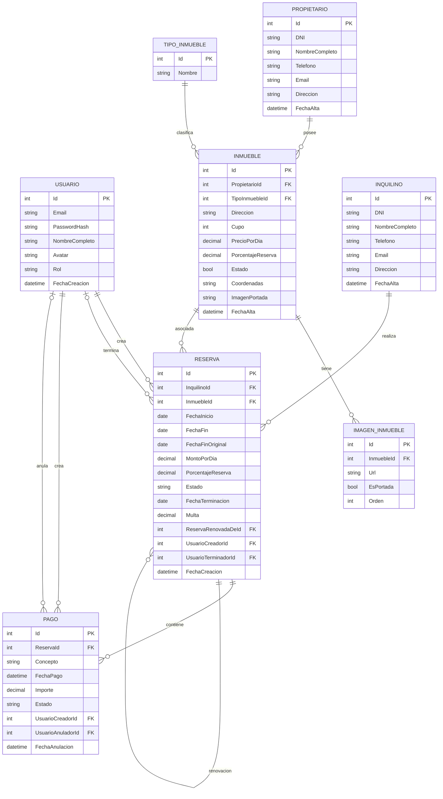

# CARAXES-INMOBILIARIA-LAB2

> Sistema de gestión de alquileres temporarios para una agencia inmobiliaria.  
> Aplicación web desarrollada en ASP.NET Core MVC con ADO.NET y MySQL.

---

## 📋 Índice

1. [Integrantes del Grupo](#-integrantes-del-grupo)
2. [Descripción del Proyecto](#-descripción-del-proyecto)
3. [Tecnologías Utilizadas](#-tecnologías-utilizadas)
4. [Estructura del Repositorio](#-estructura-del-repositorio)
5. [Funcionalidades Implementadas](#-funcionalidades-implementadas)
6. [Modelo de Datos](#-modelo-de-datos)
7. [Requisitos Previos](#-requisitos-previos)
8. [Configuración de la Base de Datos](#-configuración-de-la-base-de-datos)
9. [Configuración del Proyecto](#-configuración-del-proyecto)
10. [Ejecución del Proyecto](#-ejecución-del-proyecto)
11. [Roles y Permisos](#-roles-y-permisos)
12. [Reglas de Negocio](#-reglas-de-negocio)
13. [Notas Adicionales](#-notas-adicionales)
14. [Licencia](#-licencia)

---

## 👥 Integrantes del Grupo

* **José Bossa** - *jose.bossa.3@gmail.com* - [@josebossa3-cmyk](https://github.com/josebossa3-cmyk)
* **Fernando Suarez** - *jorgefernandosuarez@gmail.com* - [@Fernando-Suarez](https://github.com/Fernando-Suarez)
* **Jesús Emanuel García** - *dupre.dev@gmail.com* - [@emadupre](https://github.com/emadupre)

---

## 📖 Descripción del Proyecto

**Caraxes Inmobiliaria** es un sistema web que informatiza la gestión de alquileres temporarios de propiedades inmuebles que realiza una agencia inmobiliaria. Permite administrar propietarios, inquilinos, inmuebles, reservas y pagos, con un sistema de autenticación basado en roles (Administrador y Empleado).

### Entidades principales

- **Propietario**: dueño de uno o varios inmuebles.
- **Inquilino**: persona que reserva el alquiler de un inmueble.
- **Inmueble**: propiedad ofrecida en alquiler, con imágenes, coordenadas y precio por día.
- **Reserva**: vínculo entre un inquilino, un inmueble y un rango de fechas.
- **Pago**: transacciones económicas asociadas a una reserva (seña, pago parcial, pago total, multa).
- **Usuario**: persona que accede al sistema con email y contraseña.
- **TipoInmueble**: clasificación de inmuebles (casa, departamento, monoambiente, loft).
- **ImagenInmueble**: imágenes adicionales de un inmueble.

---

## 🛠️ Tecnologías Utilizadas

| Tecnología | Versión / Uso |
|------------|---------------|
| .NET | 10.0 |
| ASP.NET Core MVC | Framework web |
| ADO.NET | Acceso a datos (sin Entity Framework) |
| MySqlConnector | Proveedor de MySQL |
| MySQL | 8.0 o superior |
| Bootstrap | 5.x |
| Bootstrap Icons | Íconos |
| Leaflet + OpenStreetMap | Mapas interactivos |
| BCrypt.Net | Hashing de contraseñas |
| Cookie Authentication | Autenticación con roles |

---

## 📁 Estructura del Repositorio

```text
Caraxes-inmobiliaria-lab2/
├── Controllers/
│   ├── HomeController.cs
│   ├── InmueblesController.cs
│   ├── InquilinosController.cs
│   ├── PagosController.cs
│   ├── PropietariosController.cs
│   ├── Reserva.cs
│   └── UsuariosController.cs
├── Models/
│   ├── ApplicationDbContext.cs (legacy)
│   ├── Database.cs / ErrorViewModel.cs
│   ├── Propietario.cs / PropietarioRepository.cs
│   ├── Inquilino.cs / InquilinoRepository.cs
│   ├── Inmueble.cs / InmuebleRepository.cs
│   ├── ImagenInmueble.cs / ImagenInmuebleRepository.cs
│   ├── TipoInmueble.cs / TipoInmuebleRepository.cs
│   ├── Reserva.cs / ReservaRepository.cs
│   ├── Pago.cs / PagoRepository.cs / PagosIndexViewModel.cs
│   ├── Usuario.cs / UsuarioRepository.cs
│   ├── LoginDTO.cs / CambiarPasswordDTO.cs
│   └── PaginadoResult.cs / PagosIndexViewModel.cs
├── Views/
│   ├── Home/
│   ├── Inmuebles/
│   ├── Inquilinos/
│   ├── Pagos/
│   ├── Propietarios/
│   ├── Reserva/
│   ├── Shared/
│   │   ├── _Layout.cshtml
│   │   ├── _ValidationScriptsPartial.cshtml
│   │   └── Error.cshtml
│   └── Usuarios/
├── wwwroot/
│   ├── css/site.css
│   ├── js/site.js
│   ├── lib/
│   └── uploads/inmuebles/ (imágenes subidas)
├── appsettings.json
├── inmobiliaria.csproj
├── inmobiliariadb.sql
├── Program.cs
├── .gitignore
└── README.md
```

---

## ✅ Funcionalidades Implementadas

### ABM (Alta, Baja, Modificación) completos

- **Propietarios** — con búsqueda, paginación en servidor, edición modal y eliminación modal.
- **Inquilinos** — con búsqueda, paginación en servidor, edición modal y eliminación modal.
- **Inmuebles** — con mapa OpenStreetMap, imágenes (carga múltiple), portada, tipos y coordenadas.
- **Reservas** — con carga automática del precio del inmueble, validación de solapamiento, terminación anticipada con cálculo de multa, y renovación.
- **Pagos** — con filtro por reserva, resumen de saldo, conceptos (seña, parcial, total, multa), edición de concepto y anulación lógica.
- **Usuarios** — con registro, login, perfil, cambio de contraseña, cambio de rol y gestión por administradores.

### Otras funcionalidades

- **Autenticación con cookies** y roles (`Administrador` / `Empleado`).
- **Subida de imágenes** con vista previa en el navegador.
- **Mapa interactivo** con Leaflet para seleccionar coordenadas.
- **Carrusel de imágenes** en la vista de Detalles de Inmueble.
- **Paginación y búsqueda en servidor** para los listados.
- **Cálculo automático** del monto total de una reserva.
- **Cálculo de multa** por terminación anticipada (50% o 25% del saldo restante).
- **Renovación de reservas** creando una nueva reserva vinculada a la original.
- **Auditoría de pagos** (usuario creador y anulador).
- **Eliminación lógica** de pagos (cambio de estado a "Anulado").

---

## 📐 Modelo de Datos

### Diagrama Entidad-Relación (DER)



---

## 🧰 Requisitos Previos

- **.NET SDK** 10.0 o superior
- **MySQL Server** 8.0 o superior
- **MySQL Workbench** (opcional, para ejecutar el script)
- **Visual Studio 2022** o **Visual Studio Code**

---

## 🗄️ Configuración de la Base de Datos

1. **Clonar el repositorio:**

   ```bash
   git clone https://github.com/josebossa3-cmyk/Caraxes-inmobiliaria-lab2.git
   cd Caraxes-inmobiliaria-lab2
   ```

2. **Ejecutar el script SQL:**

   - Abrir MySQL Workbench y conectarse al servidor.
   - Abrir el archivo `inmobiliariadb.sql` que está en la raíz del proyecto.
   - Ejecutar el script completo (F5 o "Execute All").
   - Esto creará la base de datos `inmobilariadb` con todas las tablas y datos de ejemplo.

   También se puede ejecutar por terminal:

   ```bash
   mysql -u root -p < inmobiliariadb.sql
   ```

3. **Verificar que las tablas se hayan creado:**

   ```sql
   USE inmobilariadb;
   SHOW TABLES;
   ```

---

## ⚙️ Configuración del Proyecto

1. Abrir el archivo `appsettings.json` ubicado en la raíz del proyecto.
2. Modificar la cadena de conexión según tu configuración de MySQL:

   ```json
   {
     "ConnectionStrings": {
       "DefaultConnection": "server=localhost;port=3306;database=inmobilariadb;user=TU_USUARIO;password=TU_CONTRASEÑA;"
     },
     "Logging": {
       "LogLevel": {
         "Default": "Information",
         "Microsoft.AspNetCore": "Warning"
       }
     },
     "AllowedHosts": "*"
   }
   ```

### 🔑 Parámetros a configurar

| Parámetro | Descripción | Valor por defecto |
|-----------|-------------|--------------------|
| `server` | Dirección del servidor MySQL | `localhost` |
| `port` | Puerto de conexión a MySQL | `3306` |
| `database` | Nombre de la base de datos | `inmobilariadb` |
| `user` | Usuario de MySQL | `root` |
| `password` | Contraseña del usuario de MySQL | *(tu contraseña)* |

> ⚠️ **Importante:** Si tu MySQL usa un puerto diferente, cambialo. Asegurate de que el servicio MySQL esté corriendo antes de ejecutar la aplicación.

---

## ▶️ Ejecución del Proyecto

### Opción A: Usando Visual Studio

1. Abrir la solución en Visual Studio.
2. Compilar con `Ctrl + Shift + B`.
3. Ejecutar con `F5` (con depuración) o `Ctrl + F5` (sin depuración).
4. El navegador se abrirá automáticamente con la aplicación.

### Opción B: Usando la línea de comandos

1. Navegar a la carpeta raíz del proyecto:

   ```bash
   cd Caraxes-inmobiliaria-lab2
   ```

2. Restaurar los paquetes NuGet:

   ```bash
   dotnet restore
   ```

3. Compilar y ejecutar:

   ```bash
   dotnet run
   ```

4. Abrir en el navegador la URL que aparece en la consola:

   ```text
   Now listening on: http://localhost:5295
   ```

---

## 👤 Roles y Permisos

El sistema cuenta con dos roles:

| Rol | Permisos |
|-----|----------|
| **Administrador** | Acceso total: ABM de todas las entidades, gestión de usuarios, cambio de roles, eliminación de registros, acceso a auditoría. |
| **Empleado** | Solo puede manipular su propio perfil (datos, contraseña, avatar) y operar sobre reservas y pagos. No puede eliminar entidades ni gestionar usuarios. |

### Datos de prueba

En el script SQL se incluyen dos usuarios de ejemplo:

| Email | Contraseña | Rol |
|-------|------------|-----|
| `admin@inmobiliaria.com` | admin123 | Administrador |
| `empleado@inmobiliaria.com` | empleado123 | Empleado |

> Las contraseñas se almacenan hasheadas con **BCrypt**.

---

## 📜 Reglas de Negocio

### Reservas

- **Validación de fechas:** `FechaFin` debe ser mayor que `FechaInicio`.
- **Solapamiento:** No se puede crear una reserva si el inmueble ya tiene otra reserva vigente en el mismo rango de fechas.
- **FechaFinOriginal:** Se guarda una copia de `FechaFin` al crear la reserva, para conservar la fecha pactada originalmente.
- **Renovación:** No modifica la reserva original; crea una nueva reserva vinculada y marca la original como `Finalizada`.

### Terminación anticipada

- Al terminar una reserva antes de tiempo, se calcula una multa:
  - Si se cumplió **menos de la mitad** del tiempo original → multa = **50%** del saldo restante.
  - Si se cumplió **la mitad o más** → multa = **25%** del saldo restante.
- La `FechaTerminacion` se registra y la reserva pasa a estado `TerminadaAnticipadamente`.
- **No se devuelve dinero.**

### Pagos

- Los pagos se asocian a una reserva.
- **Edición:** Solo se puede editar el concepto, no el monto ni la fecha.
- **Anulación:** La eliminación es lógica (cambio de estado a `Anulado`); el pago sigue visible pero marcado.
- **Conceptos:** Seña, Pago parcial, Pago total, Multa.

### Inmuebles

- Un propietario puede tener uno o varios inmuebles.
- Un inmueble puede suspenderse temporalmente (no aparece en listados de alquiler).
- Cada inmueble tiene una imagen de portada y otras secundarias.
- Las coordenadas se capturan con un mapa interactivo (Leaflet + OpenStreetMap).

### Usuarios

- Solo administradores pueden crear, editar y eliminar usuarios.
- Cada usuario puede cambiar sus datos personales, avatar y contraseña desde su perfil.
- El email no se puede modificar (es la credencial de login).

---

## 📝 Notas Adicionales

- El proyecto utiliza **ADO.NET** con **MySqlConnector** en lugar de Entity Framework, como se solicitó en la consigna.
- Los listados cuentan con **paginación y búsqueda** resueltas en el servidor.
- Las imágenes subidas se almacenan en `wwwroot/uploads/inmuebles/` y se referencian desde la base de datos con rutas relativas.
- El mapa usa **Leaflet** con tiles de **OpenStreetMap** (no requiere API key).
- La autenticación se implementa con **cookies de ASP.NET Core** y claims para el rol, email y avatar.
- El puerto por defecto de la aplicación es **5295**, pero puede variar según la configuración de `launchSettings.json`.
- Para desarrollo, se recomienda usar **User Secrets** para no exponer la contraseña de MySQL en el repositorio.

---

## 📄 Licencia

Este proyecto fue desarrollado con fines académicos para la materia **Laboratorio 2**.

---