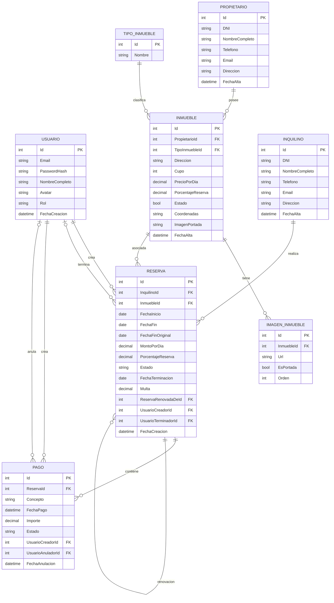

# CARAXES-INMOBILIARIA-LAB2

> Sistema de gestión de alquileres temporarios para una agencia inmobiliaria.
> Primera entrega: ABM de Propietarios e Inquilinos.

## 📑 Índice

* [Integrantes del Grupo](#-integrantes-del-grupo)
* [Modelado de Datos](#-modelado-de-datos)
  * [Diagrama Entidad-Relación (DER) / Diagrama de Clases](#diagrama-entidad-relación-der--diagrama-de-clases)
* [Cómo levantar el proyecto](#cómo-levantar-el-proyecto)
  * [Requisitos previos](#requisitos)
  * [1. Clonar el repositorio](#1-clonar-el-repositorio)
  * [2. Configurar la base de datos](#2-configurar-la-base-de-datos)
  * [3. Configurar `appsettings.json`](#3-configurar-appsettingsjson)
  * [4. Restaurar dependencias y ejecutar](#4-restaurar-dependencias-y-ejecutar)
  * [5. Acceso](#5-Acceso)

## Integrantes del Grupo

* **José Bossa** - *jose.bossa.3@gmail.com* - [@josebossa3-cmyk](https://github.com/josebossa3-cmyk)
* **Fernando Suarez** - *jorgefernandosuarez@gmail.com* - [@Fernando-Suarez](https://github.com/Fernando-Suarez)
* **Jesús Emanuel García** - *dupre.dev@gmail.com* - [@emadupre](https://github.com/emadupre)

## Modelado de Datos

### Diagrama Entidad-Relación (DER) / Diagrama de Clases



##  Cómo levantar el proyecto

Paso a paso como clonar, configurar y ejecutar el proyecto.

### Requisitos

Antes de empezar:

* [.NET SDK](https://dotnet.microsoft.com/download)
* [MySQL Server](https://dev.mysql.com/downloads/mysql/) (el proyecto usa una base de datos MySQL).
* Un cliente de MySQL (nosotros usamos DBeaver) para importar el script.
* Git

### 1. Clonar el repositorio

```bash
git clone https://github.com/josebossa3-cmyk/Caraxees-inmobiliaria-lab2.git
cd Caraxees-inmobiliaria-lab2
```

### 2. Configurar la base de datos

El repositorio incluye un script `inmobiliariadb.sql` con la estructura de la base de datos. Creá la base y ejecutá el script, por ejemplo desde la línea de comandos:

```bash
mysql -u root -p -e "CREATE DATABASE inmobiliariadb;"
mysql -u root -p inmobiliariadb < inmobiliariadb.sql
```

> Podés usar cualquier cliente MySQL para crear la base e importar el script. Lo importante es que el nombre de la base coincida con el que configures.

### 3. Configurar `appsettings.json`

El proyecto se conecta a la base de datos a través de la cadena de conexión definida en `appsettings.json`. Antes de correr el proyecto, tenes que editar ese archivo con **tus propias credenciales** de MySQL y el **puerto** correspondiente, por ejemplo:

```json
{
  "ConnectionStrings": {
    "DefaultConnection": "server=localhost;port=3306;database=inmobiliariadb;user=TU_USUARIO;password=TU_CONTRASEÑA;"
  },
  "Logging": {
    "LogLevel": {
      "Default": "Information",
      "Microsoft.AspNetCore": "Warning"
    }
  },
  "AllowedHosts": "*"
}
```

Reemplazá los siguientes valores según tu entorno local:

* `port`: el puerto en el que corre tu servidor MySQL (por defecto `3306`).
* `database`: el nombre de la base de datos que creaste en el paso anterior.
* `user`: tu usuario de MySQL.
* `password`: tu contraseña de MySQL.

### 4. Restaurar dependencias y ejecutar

Desde la raíz, restaurá los paquetes y ejecutá la aplicación:

```bash
dotnet restore
dotnet run
```

### 5. Acceso

Una vez iniciada, la consola te da la URL y el puerto en el que quedó disponible la aplicación (por ejemplo `http://localhost:5000` o `https://localhost:5001`).
